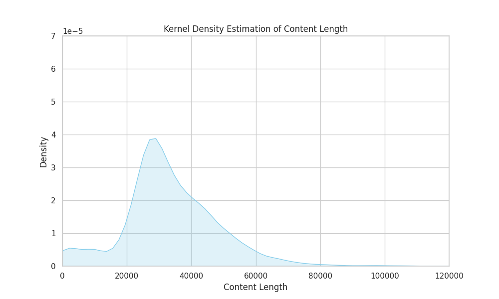

# Tagged data reports

## POS reports
- Tagged based on [pos_statistics.py](./pos_statistics.py)
- Statistics done with: [pos_noun_stats.py](./pos_noun_stats.py), [pos_verb_stats.py](./pos_verb_stats.py)


## NER reports
- Tagged based on [ner_statistics.py](./ner_statistics.py)
- Statistics done with: [ner_top_entity.py](./ner_top_entity.py)

## 10k report

- KDE:


- Statistics of 10k sample with [stats.py](./stats.py) -> approx. 4h for 10k data:
``` shell
Total number of sentences pos tagged:         2406799
Total number of sentences ner tagged:         875841
Average number of nouns per sentence:         6.735006953218777
Average number of nouns per NER sentence:     8.708636613266563
Average number of entites per sentence:       2.0446005610607405
Average number of entites per all sentences:  0.744035958133604
Average number of verbs per sentence:         2.465909699979101
Total number of noun phrases:                 16209808
Total number of unique noun phrases:          3727803
Total number of verb phrases:                 5934949
Total number of unique verb phrases:          486632
Total number of triples:                      5529110
Total number of unique triples:               5333279
```

